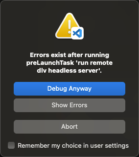

# 1. 环境准备

准备一个虚拟机环境，mac 可以用 multipass，orbstack 创建虚拟机

本项目使用 multipass

虚拟机：Ubuntu 22.04 LTS. arm64

主机：mac drawin arm64

## 1.1 安装 ubuntu

1. 创建并启动虚拟机

> multipass launch -n ubuntu -c 4 -m 4G -d 50G --network name=en0

2. 查看虚拟机状态

>   ~ ❯ multipass list
> Name State IPv4 Image
> primary Stopped -- Ubuntu 22.04 LTS
> ubuntu Running 192.168.65.6 Ubuntu 22.04 LTS

3. 进入虚拟机终端

> multipass shell ubuntu

## 1.2 安装依赖

进入终端后就开始安装 go, dlv

通过 golang 版本管理工具 `https://github.com/voidint/g` 安装

1. mkdir -p `~/.g/bin`
2. 下载[releases](https://github.com/voidint/g/releases)并解压到 `~/.g/bin` 目录下 解压后可执行文件名称为 `g` 可改名为 `gvm` 辨识度高点
3. 写入必要的环境变量

```shell
$ cat >~/.g/env <<'EOF'
#!/bin/sh
# g shell setup
export GOPATH="${HOME}/go"
export GOROOT="${HOME}/.g/go"
export PATH="${HOME}/.g/bin:${GOROOT}/bin:${GOPATH}/bin:$PATH"
export G_MIRROR=https://golang.google.cn/dl/
EOF
```

4. 将环境变量导入 终端启动配置文件 (e.g. `~/.bashrc`, `~/.zshrc`...)

```shell
$ cat >>~/.bashrc <<'EOF'
# g shell setup
if [ -f "${HOME}/.g/env" ]; then
    . "${HOME}/.g/env"
fi
EOF
```

5. 生效配置

```shell
source ~/.bashrc      # source ~/.zshrc
```

6. 安装 golang

```shell
# 查看可安装版本
gvm ls-remote
...
  1.21.9
  1.21.10
  1.22rc1
  1.22rc2
  1.22.0
  1.22.1
  1.22.2
  1.22.3

# 安装
gvm install 1.21.10

# 查看
gvm ls
  1.19.8
* 1.21.10
```

7. 设置 GOPROXY

> go env -w GOPROXY=https://goproxy.cn,direct

8. 安装 dlv

> go install github.com/go-delve/delve/cmd/dlv@latest

**如果主机和虚拟机是相同架构系统则可直接拷贝主机的 dlv 到虚拟机即可**

⚠️ 这里安装后到 dlv 是放在 `${GOPATH}/bin`目录下的，而 `${GOPATH}/bin` 生效的前提是启动了终端，vscode task 执行 shell 时并不会 `source ~/.bashrc` 会出现 `command not found`的错误，所以需要手动将 dlv 拷贝到 `/usr/local/bin/dlv`

# 2. 启动调试

启动调试出现如下报错，无影响，debug anyway



验证，打印的环境变量 `LOGNAME` 是 `ubuntu`, 如果是主机是主机的用户名

```shell
  ~ ❯ curl 192.168.65.6:8080
hello world: ubuntu
```
